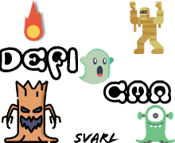

# Defi CMA - Jeu de Survie 2D

**Defi CMA** est un jeu de survie dynamique développé en Python avec la bibliothèque **Pygame**. Affrontez des vagues de monstres, survivez aux pluies de comètes et atteignez le score le plus élevé !



## 🚀 Fonctionnalités

- **Système de Combat** : Incarnez un héros capable de tirer des projectiles pour éliminer ses ennemis.
- **Ennemis Variés** : Affrontez des Momies, des Aliens et des Boss redoutables, chacun avec ses propres statistiques.
- **Événements de Comètes** : Une barre de progression se charge au fil du temps. Une fois pleine, une pluie de météorites s'abat sur le champ de bataille.
- **Gestion du Score** : Éliminez des monstres pour augmenter votre score. Le score est sauvegardé (voir `score.txt`).
- **Ambiance Sonore** : Effets sonores pour les tirs, les explosions de comètes, le clic de bouton et une musique d'ambiance.
- **Animations** : Sprites animés pour le joueur et les monstres.

## 🕹️ Contrôles

| Touche | Action |
| :--- | :--- |
| **ESPACE** | Lancer le jeu / Recommencer |
| **FLÈCHE GAUCHE** | Déplacer le joueur vers la gauche |
| **FLÈCHE DROITE** | Déplacer le joueur vers la droite |
| **W** | Tirer un projectile |
| **ÉCHAP** | Quitter le jeu |

*Vous pouvez également cliquer sur le bouton **Play** au démarrage avec la souris.*

## 🛠️ Installation

### Prérequis

- **Python 3.x** installé sur votre machine.
- La bibliothèque **Pygame**.

### Étapes

1. Clonez ce dépôt ou téléchargez les fichiers.
2. Ouvrez un terminal dans le dossier du projet.
3. Installez Pygame si ce n'est pas déjà fait :
   ```bash
   pip install pygame
   ```
4. Lancez le jeu :
   ```bash
   python main.py
   ```

## 📁 Structure du Projet

- `main.py` : Point d'entrée du programme, gère la boucle principale et l'affichage.
- `game.py` : Logique centrale du jeu (gestion des entités, collisions, score).
- `player.py` : Classe définissant le comportement du joueur.
- `Monster.py` : Classes pour les ennemis (Mummy, Alien, Boss).
- `comet_event.py` & `comet.py` : Gestion des événements de pluie de météorites.
- `Projectile.py` : Logique des tirs du joueur.
- `animation.py` : Système d'animation des sprites.
- `sounds.py` : Gestionnaire des effets sonores et de la musique.
- `Assets/` : Contient toutes les images et sons nécessaires au jeu.